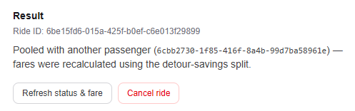
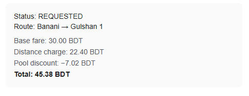
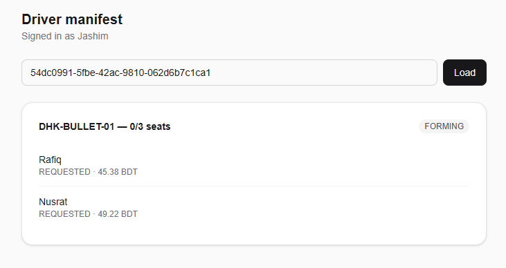
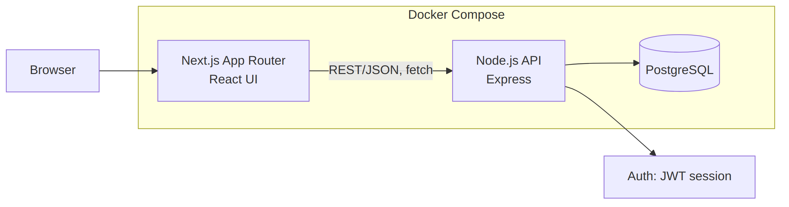
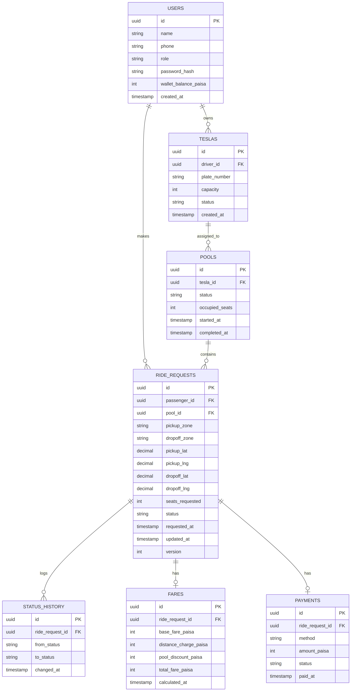
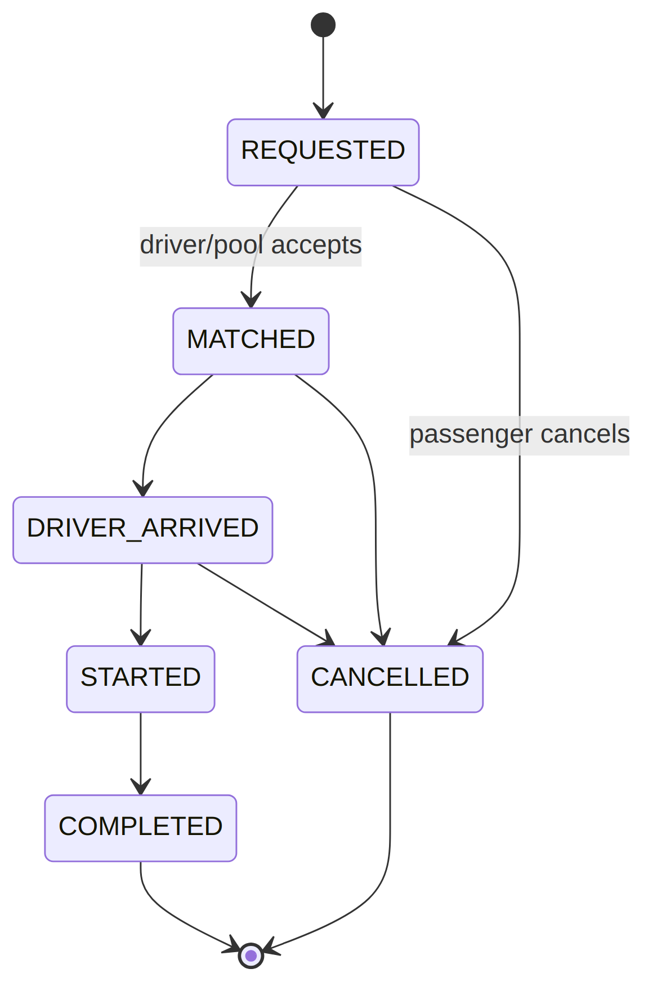

# Dhaka Tesla Pool

A ride-pooling MVP for Dhaka: request a ride, get pooled with a compatible
passenger automatically, pay a fairly split fare, and ride to completion,
with a driver-side manifest for the vehicle.

**Demo video:** [https://youtu.be/SQqAQuO6AC4](url)

## Table of contents

- [Problem, in short](#problem-in-short)
- [Screenshots](#screenshots)
- [Architecture](#architecture)
- [Tech stack](#tech-stack)
- [Project structure](#project-structure)
- [Prerequisites](#prerequisites)
- [Environment variables](#environment-variables)
- [Running it](#running-it)
- [API overview](#api-overview)
- [Demo walkthrough](#demo-walkthrough-matches-the-plans-worked-example)
- [Testing](#testing)
- [Verified end-to-end](#verified-end-to-end-not-just-written)
- [Key decisions and trade-offs](#key-decisions-and-trade-offs)
- [Known limitations](#known-limitations)
- [Next improvements](#next-improvements)
- [Deployment](#deployment)
- [AI usage](#ai-usage)

## Problem, in short

A passenger requests a ride between two points in Dhaka. If another
passenger's request overlaps enough, the system pools them into the same
vehicle instead of dispatching two, and splits the fare so pooling actually
saves both riders money. A driver sees their vehicle's manifest and moves
each passenger through pickup, ride, and drop-off. Two things make this
non-trivial and are the actual point of the assessment: deciding who can
share a ride and what each person should pay for it, and making sure two
passengers racing for the last seat on a vehicle can never both win it.

The full design reasoning (architecture, ERD, fare math, and why each
decision was made) lives in [`docs/DESIGN.md`](docs/DESIGN.md).

## Screenshots

| Passenger: pooled result | Passenger: fare breakdown | Driver: manifest |
|---|---|---|
|  |  |  |

## Architecture



Browser talks to a Next.js frontend, which calls a plain Express API over
REST/JSON. The API is the only thing that talks to Postgres, which keeps
all the pooling/capacity logic transactionally consistent in one place
rather than split across services.



Money is stored as integer paisa everywhere (never float/decimal), and
`ride_requests.version` plus `pools.occupied_seats` are what the
concurrency design (below) locks against.



Every transition shown above is validated by `api/src/lib/lifecycle.js` and
written to `status_history`, so cancellation past `STARTED` is rejected and
every status change has an audit trail.

## Tech stack

| Layer | Choice | Why |
|---|---|---|
| Frontend | Next.js (App Router, TypeScript, Tailwind) | File-based routing, easy loading/error states per route, straightforward to containerize |
| Backend | Express (Node.js) | Minimal, explicit middleware chain, easy to show exactly where auth/validation/business logic sit for a graded assessment |
| Database | PostgreSQL | Relational integrity plus `SELECT ... FOR UPDATE` and a trigger are exactly the tools the concurrency and capacity requirements need |
| ORM | Prisma | Migrations plus type-safe queries, with raw SQL (`$queryRaw`, `$executeRawUnsafe`) used specifically for the row-locking claim logic, which needs more control than the query builder gives |
| Auth | JWT (access token) + bcrypt | Stateless, simple to reason about for two roles (passenger/driver) |
| Containerization | Docker Compose (3 services: db, api, web) | One-command startup; see [Running it](#running-it) |
| Tests | Jest + Supertest | Standard, fast, and Supertest lets the integration tests hit real HTTP routes rather than calling functions directly |

Full justification and alternatives considered are in
[`docs/DESIGN.md`](docs/DESIGN.md#8-tech-stack--justification).

## Project structure

```
.
├── docker-compose.yml
├── docs/
│   ├── DESIGN.md              # full design doc: architecture, ERD, fare math, reasoning
│   └── images/                # diagrams and screenshots used in this README
├── api/
│   ├── Dockerfile
│   ├── prisma/
│   │   ├── schema.prisma      # full data model
│   │   ├── seed.js            # creates Jashim/Bullet, Nusrat, Rafiq, Shirin
│   │   └── sql/enforce_capacity_trigger.sql
│   ├── scripts/
│   │   ├── wait-for-db.js     # startup: wait for Postgres before migrating
│   │   └── apply-trigger.js   # startup: apply the capacity trigger automatically
│   └── src/
│       ├── app.js             # Express app, CORS, central error handler
│       ├── main.js            # entry point
│       ├── lib/                       # geo.js, fare.js, lifecycle.js, asyncHandler.js, prisma.js
│       ├── middleware/                # auth.js, idempotency.js
│       ├── routes/                    # auth.js, rides.js, pools.js, driver.js
│       ├── test-utils/fixtures.js     # shared test data helpers
│       └── __tests__/                 # 10 test files
└── web/
    ├── Dockerfile
    ├── lib/api.ts              # typed API client
    └── app/                    # login, register, passenger (+ history), driver pages
```

## Prerequisites

- **With Docker (recommended):** Docker and Docker Compose. Nothing else.
- **Without Docker:** Node.js 20+, npm, and a local PostgreSQL 16 instance
  (or `docker compose up -d db` to run just the database).

## Environment variables

A root [`.env.example`](.env.example) documents every variable; none of the
values in it are real secrets. Copy it to `.env` at the repo root for Docker
Compose (which loads a root `.env` automatically), or see
[Running it](#running-it) for the non-Docker path, which uses `api/.env`
instead.

| Variable | Used by | Default | Notes |
|---|---|---|---|
| `DB_PASSWORD` | Docker Compose | `tesla_dev_password` | Postgres password |
| `JWT_SECRET` | API | `dev-secret-change-me-for-real-deployments` | Sign/verify auth tokens |
| `DB_HOST` | Docker Compose (api service) | `host.docker.internal` | See the note in [Running it](#running-it) about why |
| `NEXT_PUBLIC_API_BASE` | Frontend (build-time) | `http://localhost:4000` | The URL the *browser* calls; must be set before `docker compose up --build` in Codespaces |
| `DATABASE_URL` | API (non-Docker only) | n/a, set in `api/.env` | Full Postgres connection string |
| `PORT` | API (non-Docker only) | `4000` | API port |

## Running it

### With Docker (recommended, one command)

```bash
docker compose up --build
```

That starts three containers: Postgres, the API, and the frontend. The API
container waits for the database, applies the migration, applies the
DB-level capacity trigger, seeds the demo data (Jashim, Nusrat, Rafiq,
Shirin, and the Bullet Tesla), and only then starts serving. Nothing has to
be run by hand.

- Frontend: http://localhost:3000
- API: http://localhost:4000 (health check at `/health`)
- Demo logins: see [Demo walkthrough](#demo-walkthrough-matches-the-plans-worked-example) (password `password123` for everyone)
- Reset everything to a clean state: `docker compose down -v`

Defaults work with zero configuration. To override them, copy
`.env.example` to `.env` at the repo root and edit it; Compose reads that
file automatically.

Two Docker specifics worth knowing:

- **How the API reaches Postgres.** By default the API connects through
  `host.docker.internal` (the host's published port 5432). This is the
  route verified to work in GitHub Codespaces, Docker Desktop, and regular
  Linux Docker. Direct container-to-container traffic by service name
  (`db`) was found to be blocked in Codespaces specifically, so the host
  route is the default; on a normal Docker machine `DB_HOST=db` in `.env`
  switches to Compose's internal network instead (standard, but not
  something that could be verified in Codespaces).
- **Frontend API URL.** Next.js bakes `NEXT_PUBLIC_API_BASE` into the
  bundle at build time, and it's the URL the *browser* calls. The default,
  `http://localhost:4000`, is right when Docker runs on your own machine.
  In Codespaces the browser needs the forwarded URL instead: set
  `NEXT_PUBLIC_API_BASE` in `.env` to the forwarded address of port 4000
  (with that port set to Public), then run `docker compose up --build`
  again.

### Troubleshooting

- **API stuck on "Waiting for database" (`ENETUNREACH` or timeouts).**
  Usually leftover network state from an earlier run. Run
  `docker compose down`, then `docker compose up --build` again.
- **"address already in use" on port 3000 or 4000.** Another process, often
  a local `npm run dev`, is holding the port. `ss -ltnp | grep -E ':(3000|4000)'`
  shows what, and stopping it frees the port.
- **"Failed to fetch" on login in GitHub Codespaces.** The browser can't
  reach `localhost:4000` from inside a Codespace. Add
  `NEXT_PUBLIC_API_BASE=https://<codespace-name>-4000.app.github.dev` to
  `.env`, make ports 3000 and 4000 public in the Ports tab, then run
  `docker compose build --no-cache web && docker compose up -d`. The address
  is baked in at build time, so a rebuild is required. On your own machine
  the default `http://localhost:4000` is correct and none of this is needed.

### Without Docker (local development)

**Backend:**
```bash
cp .env.example api/.env          # then edit api/.env: DATABASE_URL should say localhost, fill in JWT_SECRET
docker compose up -d db           # or run your own local Postgres
cd api
npm install
npx prisma migrate dev --name init
docker compose exec -T db psql -U tesla -d tesla_pool < prisma/sql/enforce_capacity_trigger.sql
npx prisma db seed
npm run dev                        # API on :4000
```

**Frontend** (separate terminal):
```bash
cd web
cp .env.local.example .env.local   # points at http://localhost:4000 by default
npm install
npm run dev                        # UI on :3000
```

### Tests

```bash
cd api && npm test
```

The DB-dependent tests auto-detect `DATABASE_URL` from `.env` via Jest's
`setupFiles` config, no need to pass it manually. With the database running
and migrated, `npm test` runs every suite.

## API overview

All routes are JSON over REST. Authenticated routes expect
`Authorization: Bearer <token>` from `POST /auth/login`.

| Method & path | Auth | Purpose |
|---|---|---|
| `POST /auth/register` | none | Create a passenger or driver account |
| `POST /auth/login` | none | Get a JWT |
| `POST /rides` | passenger | Create a ride request; matches it against existing requests (Section 5's detour-ratio rule) and assigns a pool |
| `GET /rides` | passenger | Own ride history, newest first (`?limit=`, max 100) |
| `GET /rides/:id` | passenger, own ride only | Ride status, fare and payment |
| `POST /rides/:id/cancel` | passenger, own ride only | Cancel before `STARTED` |
| `POST /pools/:poolId/claim` | passenger, own ride only, requires `Idempotency-Key` header | Reserve an actual seat; the concurrency-critical endpoint |
| `GET /driver/tesla` | driver | The driver's Tesla and its current pool, so the driver page needs no pasted ID |
| `PATCH /driver/tesla/status` | driver | Go `ONLINE` or `OFFLINE`; refused while passengers hold seats |
| `GET /driver/pools/:poolId` | driver, own Tesla only | Manifest: every passenger in the pool with their fare, status and payment |
| `POST /driver/rides/:id/arrive` | driver, own Tesla only | `MATCHED → DRIVER_ARRIVED` |
| `POST /driver/rides/:id/start` | driver, own Tesla only | `DRIVER_ARRIVED → STARTED` |
| `POST /driver/rides/:id/complete` | driver, own Tesla only | `STARTED → COMPLETED`; auto-completes the pool if this was its last active ride |
| `POST /driver/rides/:id/collect-cash` | driver, own Tesla only | Record cash payment for a `COMPLETED` ride; amount is the stored fare, repeat calls are idempotent |
| `GET /health` | none | Liveness check, used by Docker's healthcheck |

## Demo walkthrough (matches the plan's worked example)

1. Register or use the seeded accounts (`01700000002` Nusrat, `01700000003`
   Rafiq, `01700000001` Jashim the driver, `01700000004` Shirin, all using
   password `password123`).
2. Log in as Nusrat, request Banani to Mohakhali.
3. Log in as Rafiq, request Banani to Gulshan 1. Should show "Pooled with
   another passenger", fare 45.38 BDT.
4. Each passenger clicks **Confirm seat** on their result card, then
   **Refresh status & fare**. Status moves to `MATCHED`. (This calls
   `POST /pools/:poolId/claim` with an `Idempotency-Key`.)
5. Log in as Jashim, go to `/driver`. Click **Go online** if Bullet is
   offline. Bullet's current pool loads automatically. Step each passenger
   through arrive, start, and complete, then click **Collect cash** for each.
6. Passengers can see past rides under **Ride history** on `/passenger`.

## Testing

10 test files, covering exactly what the brief asks for plus the driver and payment flows:

| Requirement (from the brief) | Test file |
|---|---|
| Bullet's capacity can never be exceeded | `pool-capacity.test.js`, `concurrency.test.js` |
| Invalid state transitions are rejected | `lifecycle.test.js`, `access-control.test.js` |
| Nusrat's and Rafiq's pooled fares calculate correctly | `fare.test.js`, `rides-matching.test.js` |
| Users can't modify another user's ride | `access-control.test.js` |
| Cancellation rules hold | `access-control.test.js` |
| Two concurrent requests can't corrupt pool capacity | `concurrency.test.js`, `pool-capacity.test.js` |
| (matching logic itself) | `geo.test.js` |
| Passengers only see their own ride history | `ride-history.test.js` |
| Driver online/offline and the offline guard | `driver-status.test.js` |
| Cash payment rules and idempotency | `cash-payment.test.js` |

Unit tests (`fare.js`, `geo.js`, `lifecycle.js`) need no database and always
run. Integration tests use real HTTP requests (via Supertest) against a real
Postgres, gated behind a live `DATABASE_URL`, and clean up exactly what they
create via `test-utils/fixtures.js`.

## Verified end-to-end, not just written

This system has been proven correct at every layer, against a live
Postgres, through `curl`, the actual browser UI, and a from-scratch Docker
build, including finding and fixing real bugs that no unit test caught on
its own:

- **Matching + fare split**: Nusrat and Rafiq pool correctly, with fares of
  exactly 4922 and 4538 paisa. Verified via `curl`, the Prisma-native test
  suite, and the actual passenger UI in a browser, all agreeing to the
  paisa.
- **Concurrency**: the last-seat race (`SELECT ... FOR UPDATE`) was run for
  real against live Postgres, two transactions fired via `Promise.all`, one
  artificially holding its lock for 150ms, and it resolved correctly every
  time. The DB trigger backstop was separately confirmed to reject a raw
  SQL attempt to overbook, bypassing the app entirely.
- **Full driver lifecycle**: both passengers walked through
  `MATCHED → DRIVER_ARRIVED → STARTED → COMPLETED` via the driver manifest
  UI, with the pool itself auto-completing once both finished.
- **Docker deployment**: from a wiped database volume, a single
  `docker compose up --build` brought up the database, API, and frontend,
  applied the migration and the capacity trigger, seeded the demo data, and
  passed the API healthcheck, all without manual steps. Verified in GitHub
  Codespaces.

### Real bugs found through manual testing (and fixed)

1. **Candidate-matching regression.** `POST /rides`'s matching query used to
   filter out any request that already had a `poolId` assigned, but solo
   requests get a `poolId` immediately. A second passenger's request that
   should have matched with an earlier solo one was silently treated as
   solo too, charging the full fare instead of the pooled discount. Caught
   by manually walking through the Nusrat-then-Rafiq flow via `curl` and
   checking the actual fare returned. Fixed and locked in with
   `rides-matching.test.js`.
2. **Test-isolation bug that deleted real data.** A regression test assumed
   it was creating its own isolated Tesla/pool, but pool assignment picks
   *any* online Tesla via `findFirst`, so the test grabbed the real seeded
   Bullet Tesla, pooled its fake users into the real Nusrat/Rafiq pool, and
   deleted that real pool during its own cleanup. Caught by checking the
   database directly after a test run. Fixed by having the test take every
   other online Tesla offline for its duration, then restoring them.
3. **A security bug: no ownership check on seat claiming.**
   `POST /pools/:id/claim` never verified that the ride request being
   claimed belonged to the caller, so any logged-in passenger could claim a
   seat for someone else's ride. Caught by re-reading the brief's testing
   requirements ("users can't modify another user's ride") and writing a
   test for it before checking the code, the test failed against the
   original code (proving the bug), then passed after adding the ownership
   check. See `access-control.test.js`.
4. **A crash-on-error bug.** Several route handlers, `/auth/login` among
   them, had no `try/catch` around their Prisma calls. In Express 4, an
   unhandled rejection from an async handler can crash the entire process,
   not just fail one request. Found while chasing an unrelated bug report:
   the database had gone down, and the next request to hit an unguarded
   route took the whole server with it. Fixed with a small `asyncHandler`
   wrapper applied to every route.
5. **The Docker setup itself had three real bugs**, found only once it was
   actually run for the first time from a clean state (`node:20-slim`
   missing OpenSSL, which broke Prisma; the capacity trigger never being
   applied automatically; and the API being unable to reach Postgres from
   inside its container). Full details in `docs/DESIGN.md`'s commit
   history and the [Docker section above](#running-it).

## Key decisions and trade-offs

- **Detour-ratio matching, not a zone list.** Whether two passengers can
  pool is decided by an actual haversine-distance calculation (a documented
  `detourRatio ≤ 1.3` threshold), not a hardcoded "these areas are near
  each other" table. Trade-off: only handles the two-passenger, shared-pickup
  case described in the brief; a third passenger or different pickup points
  would need the general routing search noted as a scaling item.
- **Fare split by actual distance saved, not a flat discount.** The pool
  discount is each passenger's proportional share of the real distance
  saved by pooling (computed by the same matching code, not estimated), so
  a passenger whose route barely overlaps the pool doesn't get the same
  discount as one who overlaps heavily.
- **Pessimistic locking (`SELECT ... FOR UPDATE`) for seat claiming,
  deliberately, not as a shortcut.** Optimistic locking is cheap when
  conflicts are rare; the last seat on a pool is exactly where contention
  concentrates, so the cheap path is never actually taken. A DB trigger
  backstops the application-level lock. Trade-off: doesn't scale to very
  high write volume on one row without moving to a distributed lock, noted
  as a scaling item, not built for the MVP.
- **No queues, no microservices.** A monolithic API keeps the
  pooling/capacity logic transactionally consistent in one place. Trade-off:
  a single Postgres instance is the ceiling on write throughput until
  read replicas or sharding are introduced, again a scaling item, not
  an MVP requirement.

Full reasoning for every decision is in [`docs/DESIGN.md`](docs/DESIGN.md).

## Known limitations

- **Only 3 of the 8 named Dhaka areas** (Banani, Mohakhali, Gulshan 1) have
  real coordinates wired up, since those are the ones the worked example in
  the brief specifically uses. The matching and fare logic itself is
  general, adding the remaining 5 areas is a data change, not a code
  change.
- **Cash only.** Drivers record cash payment after completion. The
  `TESLAPAY` enum value exists in the schema, but no simulated wallet flow
  is implemented.
- **Assignment is automatic.** A driver doesn't browse and accept
  requests. Riders are assigned to the first `ONLINE` Tesla's forming pool,
  and the driver works from that manifest. Assumption: one Tesla per driver.
- **No public deployment.** See [Deployment](#deployment) below for why,
  and what's provided instead.

## Next improvements

In priority order, if this continued past the assessment:
1. Simulated TeslaPay wallet payments alongside cash.
2. Add the remaining 5 Dhaka areas with real coordinates.
3. A driver "browse and accept requests" step instead of automatic
   assignment, plus multiple Teslas per driver.
4. The scaling items in `docs/DESIGN.md` (Section 13): geospatial indexing,
   read replicas, a distributed lock for seat-claiming at high write volume,
   and the observability/retry strategy work needed before this could
   actually handle 1M passengers.

## Deployment

Per the brief's fallback ("if free backend hosting isn't available, document
the constraint and give a reproducible Docker deployment instead"): no
public URL is provided. Attempting free-tier hosting for three services
(Postgres, API, Next.js frontend) with real inter-service networking
reliably, within the assessment's timeframe, was judged a worse use of
remaining time than hardening the Docker deployment itself, which is
documented above and has been verified from a clean state, including three
real bugs found and fixed in the process (see
[Verified end-to-end](#verified-end-to-end-not-just-written)). Running
`docker compose up --build` is the reproducible substitute.

## AI usage

This project was built with Claude (Anthropic) as a collaborator across
design, implementation, and debugging.

**Accepted suggestion:** the detour-ratio matching rule. The first instinct
was a hardcoded zone-compatibility table ("Mohakhali and Gulshan 1 are near
each other"), which works but doesn't generalize and isn't derived from
anything real. Claude proposed computing an actual detour ratio from
haversine distance instead, the same approach used in real carpooling
matching research, with a documented, tunable threshold (1.3). Accepted
because it's just as easy to hand-verify for grading as the zone-table
approach, but it's an actual formula rather than a guess.

**Rejected suggestion, then corrected:** Claude's first draft of the
concurrency section described `SELECT ... FOR UPDATE` as merely "sufficient
for MVP," almost apologetically, positioning it as a stopgap rather than a
considered choice. Pushing back for real-world grounding rather than
textbook advice led to a better version: pessimistic locking reframed as
the deliberate, correct choice for high-contention resources like a Tesla's
last seat, not a shortcut. The lesson generalized: stop accepting "good
enough for MVP" framing without asking whether it's actually the right
engineering call or just the easy one.

**Where AI assistance mattered most in practice:** the debugging, not the
initial code generation. Five real bugs made it into the codebase despite
passing unit tests (see the list above), and every one of them was found by
manually running the system end-to-end and checking actual output against
expected numbers, not by trusting that green tests meant correctness.
Claude helped root-cause each one once the symptom was visible, but the
manual verification step, actually clicking through the app, running
`docker compose up` from scratch, re-reading the brief's literal
requirements against the code, is what surfaced them in the first place.
