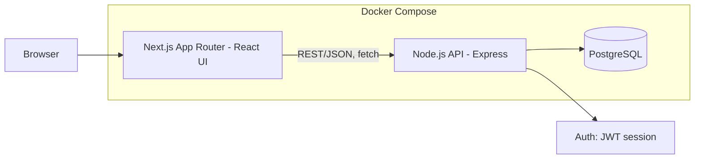
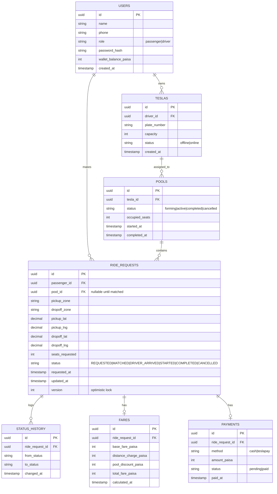
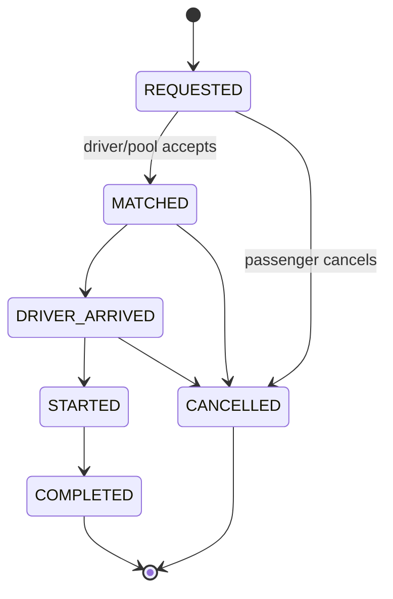

# Dhaka Tesla Pool: End-to-End Build Plan

Cast used throughout: **Jashim** (driver) / **Bullet** (3-seat "Tesla"), **Nusrat**, **Rafiq**, **Shirin** (passengers).

---

## 1. Problem Restatement (in plain terms)

A passenger requests a ride between two Dhaka areas. If another passenger's request overlaps enough with an existing one, the system can pool them into the same Tesla, as long as the vehicle's seat capacity isn't exceeded. Each passenger sees only their own fare and status. The driver sees the whole vehicle's manifest. Every ride's lifecycle is tracked from request to completion, and history is kept for later audit.

Two hard edge cases the PRD is really testing:
- **Pooling correctness**: Nusrat (→ Mohakhali) and Rafiq (→ Gulshan 1) have overlapping-but-not-identical routes from Banani, do they get pooled, and how is each one's fare computed individually?
- **Concurrency correctness**: Bullet has 1 seat left; Nusrat and Shirin both try to claim it at the same instant.

---

## 2. Architecture



No queues, no Redis, no microservices, a monolithic API is enough at MVP scale and is easier to reason about for pooling/capacity logic, which needs to be transactionally consistent in one place.

---

## 3. Data Model / ERD



**Key design notes**
- Money stored as **integer paisa** (1 BDT = 100 paisa), never `decimal`/`float`, to avoid rounding drift in repeated fare math, a classic interview question, so it's worth stating explicitly in the README.
- `ride_requests.version` is an optimistic-locking column, used for the concurrency fix (Section 6).
- `pools.occupied_seats` is a denormalized counter kept in sync inside the same transaction that inserts/removes a `ride_request` from the pool, enables a simple `CHECK (occupied_seats <= capacity)`-style guard at the app layer plus a DB constraint as backstop.
- Indexes: `ride_requests(status, pickup_zone)` for matching queries, `pools(tesla_id, status)`, `ride_requests(passenger_id)`.

---

## 4. Ride Lifecycle



Rule: cancellation is only valid before `STARTED`. Every transition is written to `status_history` (from/to/timestamp), this is what "hold onto enough history to explain what happened" (Section 2 of the PRD) actually means in schema terms.

---

## 5. Matching Rule: Detour Ratio, Not a Zone List

A fixed "these zones are compatible" table is arbitrary and doesn't generalize. Real ride-pooling systems and the car-pooling operations-research literature instead match on **detour ratio**: how much extra distance each passenger tolerates by sharing versus riding alone. This is still fully hand-computable with straight-line lat/long distance (no real routing engine needed), which keeps it inside the PRD's "keep geography simple" constraint.

**Definitions**
- `directDistance(p)` = straight-line distance from p's pickup to p's dropoff.
- `pooledRouteDistance` = distance of the shortest valid stop order for the combined pickups/dropoffs of everyone in the candidate pool (for 2 passengers sharing one pickup zone: `pickupA → pickupB → dropoffB → dropoffA` vs. the reverse ordering, take whichever is shorter).
- `detourRatio(p)` = each passenger's share of `pooledRouteDistance` up to their own dropoff, divided by `directDistance(p)`.

**Rule**: two `REQUESTED` rides can share a pool if, for every passenger in the pool, `detourRatio(p) ≤ 1.3` (i.e. no one travels more than 30% farther than their direct route) **and** combined `seats_requested` ≤ Tesla's remaining capacity. The 1.3 threshold is a documented, tunable constant, call it out explicitly in the README as an assumption per Section 17 of the PRD.

Applied to the story: Nusrat (Banani → Mohakhali, ~3.5 km direct) and Rafiq (Banani → Gulshan 1, ~2.8 km direct) share the Banani pickup point; the pooled route (Banani → Mohakhali-area drop → Gulshan 1-area drop, ordered by whichever leg is shorter first) works out to a detour ratio under 1.3 for both, so they pool. This is a stronger, more defensible rule than a static zone-compatibility table because it's derived from an actual distance calculation, and it degrades gracefully, Shirin's request only pools if her route also clears the same threshold, rather than being included or excluded purely by which zone she typed.

---

## 6. Fare Model (worked example)

```
passengerFare = baseFare + distanceCharge - poolDiscount
```

`poolDiscount` is not a flat percentage, it's each passenger's proportional share of the **actual distance saved** by pooling, which is how the carpooling fare-splitting literature approaches it: the saving from pooling is shared between passengers based on their detour distance relative to the total, rather than an arbitrary constant applied regardless of route overlap. A flat 20% for everyone is easy to compute but not defensible, a passenger whose route barely overlaps the pool shouldn't get the same discount as one who overlaps heavily. Splitting by distance keeps the model just as hand-checkable while tying it to something real.

Example constants (documented, not hard-coded magic numbers):
- `baseFare` = 30.00 BDT = 3000 paisa
- `distanceCharge` = 8.00 BDT/km = 800 paisa/km

Solo fares (no pooling):
- Nusrat solo: Banani → Mohakhali = 3.5 km → 3000 + (800×3.5) = **5800 paisa**
- Rafiq solo: Banani → Gulshan 1 = 2.8 km → 3000 + (800×2.8) = **5240 paisa**
- Combined solo total = 5800 + 5240 = 11040 paisa

Pooled route (shared Banani pickup, sequential drop-offs), using the seed
coordinates in `api/prisma/seed.js` and the shortest-order calculation in
`api/src/lib/geo.js` (not a hand estimate): 4.325 km total driven, vs. 6.3
km if driven as two separate solo trips back-to-back, a saving of 1.975 km,
priced at the same distance rate: `totalSaving = 1.975 × 800 = 1580 paisa`.

Split the saving in proportion to each passenger's direct distance (their
share of the total demand they're placing on the vehicle):
- Nusrat's share = 3.5 / (3.5+2.8) = 55.6% → saving = 878 paisa → **Nusrat's fare = 5800 − 878 = 4922 paisa (49.22 BDT)**
- Rafiq's share = 2.8 / (3.5+2.8) = 44.4% → saving = 702 paisa → **Rafiq's fare = 5240 − 702 = 4538 paisa (45.38 BDT)**

Check: 4922 + 4538 = 9460 paisa total paid, vs. 11040 paisa if both rode
solo, the pool genuinely saves both passengers money (1580 paisa combined,
matching `totalSaving`) while Jashim still gets paid for the full pooled
route distance. These exact figures are proven, not just calculated: they
match `api/src/__tests__/fare.test.js`, were verified via `curl` against a
live database, and were verified again through the actual browser UI (see
the README's "Verified end-to-end" section). The pooled distance here
(4.325 km) is shorter than this section's first hand estimate (5.1 km),
because the real seed coordinates place Mohakhali and Gulshan 1 closer
together along the route than the original back-of-envelope guess assumed,
this is exactly the kind of gap that only shows up once real code computes
real numbers instead of estimating them by hand.

---

## 7. Concurrency: Nusrat vs Shirin for Bullet's Last Seat

**Chosen approach for MVP**: pessimistic row locking (`SELECT ... FOR UPDATE`), deliberately, not as a shortcut, but because pessimistic locking is what production booking systems converge on precisely when contention concentrates on one row (a seat, a ticket, an inventory unit). Optimistic locking is the right tool when conflicts are rare and free when there's no contention; the last-seat race is the opposite case, where contention is the normal state, so the "cheap path" of optimistic locking is never actually taken.

```sql
BEGIN;
-- lock_timeout so a stuck request fails fast instead of hanging the passenger's tap
SET LOCAL lock_timeout = '2s';

SELECT occupied_seats, capacity FROM pools
  WHERE id = $1 FOR UPDATE;               -- lock the pool row, which always exists
                                            -- once the Tesla goes online

-- app checks occupied_seats < capacity
UPDATE pools SET occupied_seats = occupied_seats + 1 WHERE id = $1;
UPDATE ride_requests SET pool_id = $1, status = 'MATCHED', version = version + 1
  WHERE id = $2 AND status = 'REQUESTED';
COMMIT;
```

Three details worth carrying into the schema/API, each taken from a known failure mode in real booking systems:
- **Lock the row that's guaranteed to exist.** Lock the `pools` row (created when the Tesla goes online), not a booking/pool-membership row that might not exist yet, locking a not-yet-created row lets two transactions race past the "is it free?" check simultaneously before either has anything to lock on.
- **Backstop with a DB constraint, not just app logic.** Add a `CHECK` (or trigger) so `occupied_seats` can never exceed `capacity` at the database level, the same idea as a partial unique index that allows any number of cancelled bookings per seat but only ever one confirmed booking, enforced at the database level rather than in application code, so a bug in the lock logic still can't produce an overbooked Tesla.
- **Deterministic lock order + timeout.** If any endpoint ever needs to lock more than one row, always lock in the same order (e.g. by ID) to avoid deadlocks, and set `lock_timeout` so a request fails with a clear "seat no longer available" instead of hanging.

`SELECT ... FOR UPDATE` serializes the two concurrent claim attempts at the row level: whichever transaction (Nusrat's or Shirin's) commits first wins the seat; the second re-reads `occupied_seats`, sees capacity is full, and the API returns a clean conflict instead of corrupting the count. This is conceptually the same fix Uber's own matching engine uses for driver-acceptance races at a different scale, acceptance hits the Matching Engine, which immediately attempts to acquire a distributed lock on the trip ID, and if two drivers accept in the same window only one lock acquisition succeeds while the second gets a "trip no longer available" response. Same first-write-wins principle; Uber's is a distributed lock, yours is a Postgres row lock, worth naming explicitly as the "what changes at scale" answer.

**Idempotency.** Add an `Idempotency-Key` header (client-generated UUID) on the seat-claim endpoint specifically. Dhaka mobile networks make double-taps and silent retries likely; without it, a retried claim request could double-decrement the same passenger's own request or produce a confusing duplicate. The pattern: the client generates a unique key, attaches it to the mutating request, and the server stores the key with its result so retries with the same key return the cached result instead of re-running the claim.

**What changes at larger scale** (for the bonus section / interview): move seat-claiming into a single-writer service or distributed lock (e.g. Redis with a TTL) per Tesla, so the Postgres row lock isn't the sole serialization point once write volume is high across many concurrent pools, the same distributed-lock idea Uber uses for trip acceptance.

---

## 8. Tech Stack & Justification

| Layer | Choice | Why | Realistic alternative | Would switch if... |
|---|---|---|---|---|
| Frontend | Next.js (App Router) | File-based routing, easy loading/error states per route, good free-tier hosting story | Plain React + React Router | Needed native mobile → React Native |
| Backend | Express (Node.js) | Minimal, explicit middleware chain, easy to show exactly where validation/auth/business logic sit, which matters for a graded assessment | NestJS | Team/codebase grew large enough to need NestJS's structure/DI |
| DB | PostgreSQL | Relational integrity + `CHECK`/`FOR UPDATE` fit capacity enforcement and money-as-integer needs exactly | SQLite (fine for pure local dev) | Needed heavy geospatial → PostGIS extension (still Postgres) |
| ORM | Prisma | Migrations + type-safe queries reduce silent schema drift, good for a solo/small-team MVP timeline | Knex / raw SQL | Needed very fine-grained control over locking clauses beyond Prisma's raw-query escape hatch |
| Auth | JWT (access token) + bcrypt password hashing | Stateless, simple to reason about for two roles (passenger/driver) | Session cookies + server store | Needed refresh-token rotation / multi-device revocation at scale |
| Validation | Zod | Shared schema between FE/BE request shapes | Joi | N/A for this scope |
| Tests | Jest + Supertest (API), React Testing Library (FE) | Standard, well-documented, fast | Vitest | Already on Vite tooling |
| Hosting | Render/Railway free tier (API+DB) + Vercel (FE) | Free, supports Docker/Postgres | Fly.io | Free tier limits hit |

---

## 9. Docker Compose Skeleton

```yaml
services:
  db:
    image: postgres:16
    environment:
      POSTGRES_DB: tesla_pool
      POSTGRES_USER: tesla
      POSTGRES_PASSWORD: ${DB_PASSWORD}
    ports: ["5432:5432"]
    volumes: ["pgdata:/var/lib/postgresql/data"]
    healthcheck:
      test: ["CMD-SHELL", "pg_isready -U tesla"]
      interval: 5s
      retries: 5

  api:
    build: ./api
    env_file: .env
    depends_on:
      db:
        condition: service_healthy
    ports: ["4000:4000"]
    command: sh -c "npx prisma migrate deploy && npx prisma db seed && node dist/main.js"

  web:
    build: ./web
    env_file: .env
    depends_on: [api]
    ports: ["3000:3000"]

volumes:
  pgdata:
```

Seed script (`prisma/seed.ts`) creates Jashim/Bullet, Nusrat, Rafiq, Shirin with the exact Banani/Mohakhali/Gulshan-1 trip data used in Section 6's fare example, so the evaluator can reproduce your hand calculation directly.

---

## 10. Git Workflow Plan

Branches: `master`, `pre-release`, `release/v1.0.0`, plus feature branches:
- `feature/passenger-auth`
- `feature/driver-flow`
- `feature/tesla-pooling`
- `feature/fare-engine`
- `feature/docker-setup`

Example commit sequence on `feature/tesla-pooling`:
```
feat(pool): add pools and pool matching schema
feat(pool): implement zone-compatibility matching rule
feat(pool): enforce Bullet's seat capacity via FOR UPDATE lock
test(pool): concurrent claim on last seat resolves without overbooking
fix(pool): reject match when discovered capacity is stale
```
Merge into `master` once each feature is demonstrably working → cut `pre-release` once all MVP features are integrated (docs, deployment checks) → cut `release/v1.0.0` from `pre-release` for the submitted/video version.

---

## 11. Testing Plan (maps directly to Section 12 of the PRD)

| Behavior | Test type |
|---|---|
| Bullet's capacity never exceeded under concurrent claims | Integration test, two parallel requests against `/pools/:id/claim` |
| Invalid state transitions rejected (e.g. `REQUESTED → STARTED`) | Unit test on state machine function |
| Nusrat's and Rafiq's pooled fares calculate correctly | Unit test against Section 6's numbers |
| Users can't view/modify another user's ride | Integration test: Nusrat's JWT hitting Rafiq's ride ID → 403 |
| Cancellation rules hold (blocked after `STARTED`) | Unit test |
| Concurrent requests can't corrupt pool capacity | Integration test with `Promise.all` on two claim calls |
| Detour ratio matching accepts Nusrat+Rafiq, rejects a route that exceeds the threshold | Unit test against the 1.3 constant from Section 5 |
| Retried seat-claim with the same idempotency key doesn't double-claim | Integration test: fire the same request twice, assert one seat consumed |

---

## 12. README Outline (ready to fill in as you build)

1. Summary & problem statement
2. Features implemented + screenshots/GIFs
3. Architecture diagram + ERD (from Sections 2–3 above)
4. Tech stack + justification table (Section 8)
5. Project structure
6. Prerequisites, `.env.example`
7. Local setup + Docker instructions + migrations/seed
8. Running frontend/backend/tests, demo credentials (Jashim/Nusrat/Rafiq/Shirin)
9. Deployment URL, API overview
10. Key decisions & trade-offs (fare-as-integer-paisa, pessimistic locking choice, no queues/microservices)
11. Known limitations, next improvements
12. AI Usage section (tool, one accepted suggestion, one rejected suggestion + why)
13. Demo video link

---

## 13. Bonus: Scaling to 1M Passengers / 100k Drivers (reasoning sketch)

- **Matching/geospatial**: replace zone-string matching with PostGIS `ST_DWithin` + geohash bucketing for candidate pre-filtering before a compatibility check.
- **DB contention**: move from row-level `FOR UPDATE` to a sharded seat-reservation service (per-Tesla actor/lock, e.g. via Redis) so hot Teslas don't serialize all writers through Postgres.
- **Read scaling**: read replicas for ride-history/rating queries; keep the hot path (matching, capacity) on the primary.
- **Caching**: cache zone-adjacency and fare-constant lookups (rarely change) in-memory/Redis; never cache live seat counts.
- **Async work**: move notifications, receipts, and rating aggregation off the request path via a lightweight queue (SQS/RabbitMQ), but only introduced here, not in the MVP, per Section 9's explicit "don't add Kafka/K8s to look advanced."
- **Real-time**: WebSocket or SSE channel per active ride for driver/passenger status pushes instead of polling.
- **Reliability**: idempotency keys on claim/cancel endpoints (a retried request must not double-claim a seat); rate limiting per passenger/driver on request endpoints.
- **Observability**: structured logs + request tracing IDs threaded through match → claim → fare calc, since that's the exact path that broke in the concurrency scenario.
- **Deployment**: horizontally scale stateless API instances behind a load balancer; DB stays the single source of truth with the sharding/replica strategy above.

---

## 14. Video Script Outline (6 min max)

- **0:00–1:00**, Problem in your own words: passengers, driver, pooling, why fairness/consistency matter.
- **1:00–3:00**, Architecture + ERD walkthrough, one key decision (paisa-as-integer or pessimistic locking), one trade-off (no microservices at this scale).
- **3:00–6:00**, Live tour: Nusrat requests, Rafiq requests and gets pooled, Jashim accepts/starts/completes, fares shown per-passenger, then the Nusrat-vs-Shirin last-seat race as the edge case, deployment link if live.

---

*Everything above is a starting design, treat it as a first draft to argue with, not a spec to copy blindly. Wherever you deviate (different matching rule, different lock strategy, different stack), just document why, per Section 17 of the PRD.*
